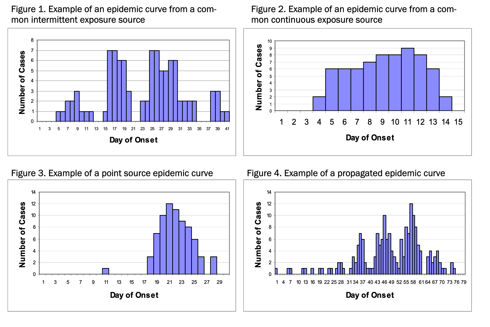

# Overview

A well-made graphic can reveal patterns that tables never will. In this session we:

1.  Show **why epidemic curves are a first-line tool** for any outbreak.\
    • They display when cases occur, uncovering the shape of transmission (point-source, continuous, intermittent, propagated).\
    • They flag data-quality issues (back-logs, date miscoding) and help estimate key parameters such as onset-to-reporting delay or serial interval.\
    • They give decision-makers an instant read on whether control measures are working.

2.  **Build epi-curves step-by-step in R.**\

    a.  Start with basic histograms to explore continuous variables (e.g., age) and confirm date formats.\
    b.  Create daily epi-curves for rapid detection of spikes.\
    c.  Aggregate to weekly bars to smooth weekday-weekend noise.\
    d.  Add stratification (state, age group, water source, outcome) and facet panels to compare parallel epidemics.\
    e.  Layer rolling averages to visualise underlying trends.

3.  **Transition from time to place: mapping the outbreak.**\

    a.  Choropleth maps of case counts by state give a quick geographic overview for briefings.\
    b.  Standardise by population to highlight *risk* rather than raw numbers and avoid the “big-area bias.”\
    c.  Drill down to point-level maps when GPS coordinates are available, exposing micro-clusters along rivers, roads, or neighbourhoods.\
    d.  Convert static maps to interactive `plotly` dashboards so field teams can zoom, hover, and filter in real time.

By mastering these visual and spatial techniques, you’ll be able to turn a line-list into compelling stories that guide public-health action—whether you’re alerting leaders to a rising case-fatality ratio, spotting a shift in exposure sources, or pinpointing emerging hotspots for rapid response.

# Packages used for this session

```{r}
pacman::p_load(
  # ── Core Infrastructure & Data I/O ─────────────────────────────────────────
  here,         # Relative file pathways to prevent broken working directory links
  rio,          # Swiss-Army knife for importing/exporting data (xlsx, csv, rds)
  tidyverse,    # Core ecosystem (ggplot2, dplyr, tidyr) for data science & viz
  
  # ── Data Cleaning & Standardisation ────────────────────────────────────────
  janitor,      # Clean column names, find duplicates, and build quick tabyls
  lubridate,    # Parsing and executing calculations on epidemic date vectors
  
  # ── Spatial Mapping & Geographics ──────────────────────────────────────────
  sf,           # Handling Simple Features geospatial vector data and polygons
  scales,       # Internal label formatting (e.g., shorthand axis percentages)
  
  # ── Advanced Visualization ─────────────────────────────────────────────────
  plotly,       # Rendering static ggplot matrices into interactive HTML widgets
  slider,       # Calculating sliding windows for trailing rolling averages
  RColorBrewer  # Accessing color palettes designed for categorical features
)
```

# Load data

First, we import the cleaned cholera line-list generated during our data-cleaning modules. We verify that all date vectors are explicitly recognized by the R environment.

```{r}
# ───────────────  Load cleaned cholera line-list and prep key fields  ───────────────
cholera_linelist <- import(here("processed_data", "cholera_linelist_clean.xlsx")) %>% 
  mutate(
    onset_date = as.Date(onset_date),   # ensure onset dates are true Date objects
    longitude  = as.numeric(longitude), # coerce longitude to numeric for mapping
    latitude   = as.numeric(latitude)   # coerce latitude  to numeric for mapping
  )
```

Next, we load the Sudan administrative boundary shapefile (level 1) for mapping. This file contains the polygons for each state in Sudan, which we will use to create choropleth maps and point maps of cholera cases.

```{r}
sudan_adm1 <- readRDS(here("data_spatial", "sudan_adm1.rds"))
```

# Epidemic Curves: Temporal Dynamics of Outbreaks

An Epidemic Curve (Epi-curve) is a visual histogram of an outbreak that plots the number of emergent cases along the Y-axis against their specific date of symptom onset along the X-axis.

An epi-curve provides essential visual clues about the outbreak's magnitude, outliers, time trends, and primary mode of transmission:

- **Point Source Outbreak:** A single, brief exposure. Cases surge to a sharp peak and then drop off. The entire curve typically fits within one incubation period and may be slightly right-skewed rather than perfectly symmetrical.

- **Continuous Common Source**: Exposure is prolonged (e.g., a contaminated water main). Case counts rise gradually, plateau while the source remains active, and fall once the source is removed or immunity builds.

- **Intermittent Common Source:** Exposure is sporadic—​for instance, a market stall that operates only on certain days or bouts of heavy seasonal rain that periodically flood and contaminate wells. The epi-curve therefore shows a series of jagged peaks separated by disease-free gaps that mirror the timing of each exposure episode.

- **Propagated Outbreak:** Spread person-to-person. Secondary transmission creates successive, increasingly higher waves. Peaks are often spaced roughly one incubation period apart, although reporting delays can blur this spacing.

These characteristic patterns guide questions about exposure, help time control measures, and allow quick assessment of whether interventions are bending the curve.



## Basic Epidemic Curve – Daily Bars

We begin with the highest‐resolution view of the outbreak. By setting the histogram bin width to one day, each bar represents the number of cases whose symptom onset occurred on that specific calendar date.

Why start this way?\
• Pinpoints the earliest onset date and any sudden spikes, helping identify the index case or a single-day exposure event.\
• Exposes gaps or back-logs in reporting that might distort later analyses.\
• Provides real-time feedback on whether control measures introduced yesterday are affecting today’s case counts.

After this daily snapshot we can safely aggregate to weekly bins or add stratifications to answer broader questions.

```{r}
ggplot(data = cholera_linelist, aes(x = onset_date)) +          # initialise ggplot with onset dates on x-axis
  geom_histogram(binwidth = 1,                                  # one bar per day (highest temporal resolution)
                 fill = "darkred", color = "black", linewidth = 0.2) +  # red bars with thin black borders
  scale_x_date(date_breaks = "1 week", labels = label_date_short()) +   # tick marks every week, short date labels
  theme_minimal() +                                             # clean, minimal background
  labs(title = "Daily Epidemic Curve of Cholera Outbreak",      # plot title
       x = "Date of Symptom Onset",                             # x-axis label
       y = "Daily Case Incidences")                             # y-axis label
```

+------------------------------------------------------------------------------------------------------------------------------------------------+
| Exercise Breakout                                                                                                                              |
+================================================================================================================================================+
| We’ll pause for a short breakout exercise. You’ll be placed into breakout rooms now.                                                           |
|                                                                                                                                                |
| Please open **“Session 3: Plots, Epi-Curves, and Maps_Exercise”**. Once it opens:                                                              |
|                                                                                                                                                |
| - Complete **Step 1: Load and Prepare the Cleaned Data** and **Step 2: Constructing a Baseline Daily Epidemic Curve**                          |
|                                                                                                                                                |
| You can work on this together in your breakout room—talk through the steps and problem-solve as a group. You’ll have **20 minutes** to finish. |
+------------------------------------------------------------------------------------------------------------------------------------------------+

## Stratified Epidemic Curve – Weekly Bars

During a prolonged outbreak the day-to-day counts often look erratic because of reporting delays, weekend closures, or batching of laboratory results. Grouping onsets into seven-day blocks (“epi-weeks”) smooths this noise and highlights the underlying trajectory.

By mapping a categorical variable (e.g., `state_name`) to the bar fill:

- We still see the total height of the weekly bar (overall burden)

- Colored segments show how that burden is distributed across states, making geographic spread—or a shift in the dominant hotspot—immediately visible.

This weekly, stratified view is ideal for situation reports and for spotting whether transmission is expanding into new areas even when the national curve appears stable.

**NOTE: You can substitute any categorical variable for `state_name` to answer different epidemiologic questions:**

- `sex` → demographic differences

- `outcome`→ severity or intervention impact

- `water_source`→ source attribution

Choose a variable with a manageable number of levels (ideally \<10) so the stacked colors remain interpretable.

```{r}
# ──────────  Weekly, state-stratified epidemic curve  ──────────
ggplot(cholera_linelist,                                     # ➊ data frame with one row per case
       aes(x = onset_date, fill = state_name)) +             # ➋ map onset date to x-axis; colour bars by state
  geom_histogram(binwidth = 7,                               # ➌ 7-day bin width → epi-weeks; bars are stacked
                 position = "stack",
                 color = "white", linewidth = 0.2) +         # ➍ thin white borders separate stacked segments
  scale_fill_brewer(palette = "Dark2") +                     # ➎ colourblind-safe qualitative palette for states
  # Alternative palettes:
  # scale_fill_viridis_d(option = "plasma")
  # scale_fill_viridis_d(option = "rocket")
  scale_x_date(date_breaks = "2 weeks",                      # ➏ x-axis ticks every 2 weeks
               labels = label_date_short()) +                #     compact date labels (e.g., "03 Feb")
  labs(title = "Weekly Cholera Cases Stratified by State",   # ➐ descriptive title
       x = "Date of Symptom Onset (7-day bins)",             #     x-axis label
       y = "Number of Cases",                                #     y-axis label
       fill = "State Name") +                                     #     legend title
  theme_minimal()                                            # ➑ clean background, minimal distractions
```

## Faceted Epidemic Curves – Small-multiples for Parallel Timelines

Faceted Epidemic Curves – Small-multiples for Parallel Timelines

When you suspect that different areas—or sub-populations—have distinct exposure pathways, a single stacked curve can hide important contrasts. `facet_wrap()` solves this by producing one mini-curve per category, all sharing the same calendar axis.

What faceting adds:

- Parallel timelines: Peaks line up horizontally, making it easy to see whether regions surge simultaneously (shared source) or sequentially (spread).

- Independent vertical scales (optional): `scales = "free_y"` lets each panel auto-scale so low-incidence areas aren’t flattened by a few large outbreaks elsewhere.

- Rapid hypothesis checks: Compare urban vs. rural LGAs, upstream vs. downstream water systems, or chlorinated vs. unchlorinated supplies without rewriting the plot.

```{r}
# ──────────  Faceted, water-source-stratified epidemic curves by state  ──────────
ggplot(cholera_linelist,                                        # ➊ full line-list (one row = one cholera case)
       aes(x = onset_date, fill = water_source)) +              # ➋ onset date on x-axis; colour bars by water source
  geom_histogram(binwidth = 7,                                  # ➌ 7-day bin = epi-week (smooths daily noise)
                 position  = "stack",                           #     stack segments so total bar height = weekly total
                 color     = "white",                           #     thin white borders separate stacked segments
                 linewidth = 0.1) +
  scale_fill_brewer(palette = "Set1") +                         # ➍ alternative palettes shown but commented
  # scale_fill_viridis_d(option = "plasma")
  # scale_fill_brewer(palette = "Dark2")
  # scale_fill_viridis_d(option = "rocket")
  labs(title = "Weekly Cholera Curves by State, Stratified by Water Source", # ➎ title
       x     = "Date of Symptom Onset (7-day bins)",             #     x-axis label
       y     = "Number of Cases",                                #     y-axis label
       fill  = "Water Source") +                                 #     legend title
  theme_minimal() +                                              # ➏ clean, publication-ready theme
  facet_wrap(~ state_name,                                       # ➐ parallel timelines for each state
             scales = "free_y")                                  #  independent y-scales prevent small curves from flattening
```

## Localised Deep-Dive – Gezira State

Once broad, country-wide patterns are clear, the next step is to zoom in on priority areas. Gezira State—currently reporting the largest cumulative case load—warrants its own, more granular epidemic curve.

What the deep-dive shows:

- Intra-state dynamics: multiple waves or a single sustained peak?

- Shifts in clinical severity: mapping `fill = outcome` reveals whether the proportion of severe / fatal cases is changing.

- Operational cadence: a finer x-axis (daily bins) can capture the impact of specific interventions or public-health alerts issued within the state.

**NOTE: You can always change the variable mapped to fill to stratify by a different variable, such as patient outcome. This allows us to see not only the number of cases over time but also how the severity of cases may have evolved during the outbreak.**

```{r}
# ──────────  Gezira State deep-dive: weekly epi-curve stratified by sex  ──────────
ggplot(
  data = cholera_linelist %>%                     # ➊ start with national line-list …
           dplyr::filter(state_name == "Gezira"), #    … and keep only Gezira State
  aes(x = onset_date, fill = sex)                 # ➋ x-axis = onset date; stack bars by sex
) +
  geom_histogram(
    binwidth = 7,                                 # ➌ 7-day bins (epi-weeks) smooth daily noise
    position  = "stack",                          #     stack sexes so total height = weekly total
    color     = "white",                          #     thin white borders separate segments
    linewidth = 0.15
  ) +
  scale_fill_brewer(palette = "Dark2") +          # ➍ alternative palette shown but commented
  # scale_fill_viridis_d(option = "rocket")
  labs(
    title = "Weekly Cholera Cases in Gezira State, Stratified by Sex", # ➎ title aligned with mapping
    x     = "Date of Symptom Onset (7-day bins)",                      #     x-axis label
    y     = "Number of Cases",                                         #     y-axis label
    fill  = "Sex"                                                      #     legend title
  ) +  
  theme_minimal()                                                     # ➏ clean, publication-ready theme
```

+------------------------------------------------------------------------------------------------------------------------------------------------+
| Exercise Breakout                                                                                                                              |
+================================================================================================================================================+
| We’ll pause for a short breakout exercise. You’ll be placed into breakout rooms now.                                                           |
|                                                                                                                                                |
| Please open **“Session 3: Plots, Epi-Curves, and Maps_Exercise”**. Once it opens:                                                              |
|                                                                                                                                                |
| - Complete **Step 3: Stratified Weekly Facet Analysis** and **Step 4: Localized Deep Dive with a 7-Day Trailing Moving Average**               |
|                                                                                                                                                |
| You can work on this together in your breakout room—talk through the steps and problem-solve as a group. You’ll have **20 minutes** to finish. |
+------------------------------------------------------------------------------------------------------------------------------------------------+

# Geographic Mapping: Visualizing Spatial Spread

## Simple map with case counts by state

To visualize the spatial distribution of cases, we can create a geographic map. This requires geospatial data for the regions of interest, which can be obtained from sources like Natural Earth or GADM. We will use the `sf` package to handle spatial data and `ggplot2` for plotting.

Here is an example of a chloropleth map showing the number of cases per state in Sudan. The code includes steps to ensure that the state names in the line list match those in the spatial data, and it aggregates any unrecognized states into an "Other/Unknown" category.

### Why include a map?

Outbreak curves tell you **when** cases occur; maps reveal **where** they cluster.

A simple state-level (ADM-1) choropleth lets public health workers spot geographic hot-spots and silent areas communicate findings to decision-makers visually

### The absolute minimum you need for an ADM-1 map

1.  A table of case counts by state: This is our **cholera_linelist**

    - one row per state, one column with the count (or rate)

    - the state names must match those in the boundary file

2.  A vector boundary file for Sudan’s states in **sf** format: this is the **sudan_adm1** file we imported in the beginning

    - You can get it in two ways:

      - Official shapefile/GeoPackage from the national mapping agency or MOH

      - One-line download from GADM via {geodata} (shown below)

```{r}
library(dplyr)
library(tidyr)   # for replace_na()
library(sf)
    
# ── 1.  Vector of valid state names (from the line list) ───────────────
valid_states <- unique(cholera_linelist$state_name)
valid_states
#>  [1] "Blue Nile"     "Gezira"        "Kassala"       "Khartoum"
#>  [5] "North Darfur"  "Other/Unknown" "Red Sea"       "South Darfur"
#>  [9] "White Nile"

# ── 2.  Recode polygons: any name NOT in that vector ⇒ "Other/Unknown" ─
sudan_adm1 <- sudan_adm1 %>%           # your sf object with a 'NAME_1' column
  mutate(
    state_name = if_else(
      NAME_1 %in% valid_states,
      NAME_1,              # keep the recognised name
      "Other/Unknown"        # collapse everything else
    )
  )

# ── 3.  Aggregate polygons now labelled "Other/Unknown"  ───────────────
#       (optional but tidy; avoids overlapping geometries)
sudan_adm1_agg <- sudan_adm1 %>%
  group_by(state_name) %>%             # 9 known + 1 "Other/Unknown"
  summarise(geometry = st_union(geometry), .groups = "drop")

# ── 4.  Re-count cases in the line list (collapse unknowns too) ────────
cholera_counts <- cholera_linelist %>%
  mutate(
    state_name = if_else(
      state_name %in% valid_states,
      state_name,
      "Other/Unknown"
    )
  ) %>%
  count(state_name, name = "n_cases")

# ── 5.  Join counts onto polygons (names now align)  ───────────────────
map_df <- sudan_adm1_agg %>%
  left_join(cholera_counts, by = "state_name") %>%
  replace_na(list(n_cases = 0))

# ── 6.  Plot ───────────────────────────────────────────────────────────
ggplot(map_df) +
  geom_sf(aes(fill = n_cases), colour = "grey40", linewidth = 0.3) +
  scale_fill_viridis_c(option = "plasma", direction = -1) +
  labs(title = "Cholera Cases per State, Sudan 2025",
       fill  = "Cases") +
  theme_minimal()
```

## Standardized Incidence Mapping

Plotting **raw case counts** can be misleading: large or densely populated states almost always appear as the biggest hotspots, even if their *per-capita risk* is average.

To show where people are truly at higher risk, map a **standardized incidence rate** (e.g., cases per 100 000 inhabitants).

How we’ll do it:

1.  Compile (or download) a table of official 2025 state-level population estimates. 

2.  Join that table to the state-level case counts we already computed. 

3.  Calculate the incidence:

```{r}
library(dplyr)
library(tidyr)
library(sf)
library(ggplot2)

# 1. Comprehensive 18-State Master Population Reference
state_pops <- tibble(
  state_name = c(
    "Khartoum", "South Darfur", "Gezira", "North Kordofan", 
    "Kassala", "Central Darfur", "White Nile", "North Darfur", 
    "Al Qadarif", "South Kordofan", "Sennar", "West Darfur", 
    "River Nile", "Red Sea", "West Kordofan", "East Darfur", 
    "Blue Nile", "Northern"
  ),
  population = c(
    7993900, 5353025, 5096920, 3174029, 
    2519071, 2499000, 2493880, 2304950, 
    2208385, 2107623, 1918692, 1775945, 
    1511442, 1482053, 1724897, 1587200, 
    1108391,  936255
  )
)

# 2. Harmonize Shapefile Strings on the fly
sudan_adm1_clean <- sudan_adm1 %>%
  mutate(
    state_name = case_when(
      NAME_1 == "Southern Darfur" ~ "South Darfur",
      NAME_1 == "North Kordufan"  ~ "North Kordofan",
      NAME_1 == "Gedarif"         ~ "Al Qadarif",
      NAME_1 == "Eastern Darfur"  ~ "East Darfur",
      NAME_1 == "Western Darfur"  ~ "West Darfur",
      TRUE                          ~ NAME_1
    )
  )

# 3. Aggregate Line List Counts (Handling real missingness cleanly)
cholera_counts <- cholera_linelist %>%
  mutate(
    state_name = case_when(
      state_name == "South Darfur"   ~ "South Darfur",
      is.na(state_name)              ~ "Unspecified Location",
      state_name == "Other/Unknown"  ~ "Unspecified Location",
      TRUE                          ~ state_name
    )
  ) %>%
  count(state_name, name = "n_cases")

# 4. The Complete Left-Join (Preserves ALL 18 spatial polygons)
map_df <- sudan_adm1_clean %>%
  left_join(cholera_counts, by = "state_name") %>%
  left_join(state_pops, by = "state_name") %>%
  mutate(
    # True structural zeros: If a state isn't in the linelist, it has 0 cases
    n_cases = replace_na(n_cases, 0),
    # Calculate stable incidence rates across the entire country
    cases_per_100k = (n_cases / population) * 100000
  )

# 5. Plot the complete, non-broken national map
ggplot(map_df) +
  geom_sf(aes(fill = cases_per_100k), colour = "grey40", linewidth = 0.3) +
  scale_fill_viridis_c(option = "plasma", direction = -1, na.value = "grey70") +
  labs(
    title = "National Cholera Incidence Matrix, Sudan 2025",
    subtitle = "Population-standardized risk maps derived from unaltered field line-lists",
    fill  = "Cases per 100k"
  ) +
  theme_minimal()
```

## Point-level (dot-density) maps: seeing clusters inside the states

Admin-level choropleths tell you *which* states are most affected, but they hide *where* the cases sit inside those borders.\
If your line-list contains GPS coordinates (latitude & longitude), you can plot every case as a dot on top of the state polygons and reveal:

• micro-clusters along rivers, roads, or markets\
• urban vs rural contrasts inside the same state\
• unexpected gaps that may signal under-reporting

What you need 

1.  Two numeric columns: `latitude`, `longitude` for each case. 

2.  The same state-boundary **sf** layer you used for the choropleth (optional but helpful for context).

```{r}
# Coerce coordinates to spatial points object using WGS84 CRS (4326)
cholera_pts <- cholera_linelist %>%
  # 1. Look at your column names and map them safely here.
  #    Change 'longitutde' or 'lng' to whatever is actually in your spreadsheet.
  rename(
    longitude = longitude, # <-- Fix if it's actually "long", "Longitude", etc.
    latitude  = latitude   # <-- Fix if it's actually "lat", "Latitude", etc.
  ) %>% 
  
  # 2. Filter out missing coordinates
  filter(!is.na(longitude) & !is.na(latitude)) %>%
  
  # 3. This will now run flawlessly because the names are guaranteed to match
  st_as_sf(coords = c("longitude", "latitude"), crs = 4326, remove = FALSE)

# Ensure the boundary maps utilize matching coordinate projections
sudan_adm1_crs <- st_transform(sudan_adm1, 4326)

ggplot() +
  geom_sf(data = sudan_adm1_crs, fill = "grey90", colour = "grey75", linewidth = 0.2) +
  geom_sf(data = cholera_pts, alpha = 0.4, size = 1.2, colour = "darkred") +
  coord_sf(xlim = c(21, 39), ylim = c(9, 22)) +
  labs(title = "Spatial Point Distribution of Confirmed Cholera Cases",
       subtitle = "Sudan Field Surveillance Log, 2025",
       x = "Longitude", y = "Latitude") +
  theme_minimal()
```

## Interactive web maps: let users zoom, pan, and query

Static figures are perfect for a printed sit-rep, but field teams often need to zoom in, inspect tool-tips, and turn layers on or off.\
With one extra line of code you can convert any `ggplot2` map into an interactive HTML widget using **`plotly`**.

What it gives you:

- Scroll-wheel zoom and drag-to-pan

- Hover tool-tips that show case counts, incidence, or any other variable

- Ability to embed the map in an R Markdown report, a Shiny dashboard, or a standalone `.html` file you can email

Minimum ingredients 

1.  A finished `ggplot` object (choropleth or dot map) 

2.  The `plotly` package

```{r}
library(ggplot2)
library(plotly) 
library(sf)

# 1. Keep points as a completely flat dataframe
cholera_pts_df <- cholera_linelist %>%   
  filter(!is.na(longitude) & !is.na(latitude)) 

# 2. CRITICAL FIX: Transform AND cast the background boundaries to MULTIPOLYGON
sudan_boundaries <- st_transform(sudan_adm1, 4326) %>% 
  st_cast("MULTIPOLYGON") # <-- This strips away the problematic sfc_GEOMETRY class

# 3. Build the static ggplot object
sf_point_map <- ggplot() +
  # Background map layer (now sanitized for plotly)
  geom_sf(data = sudan_boundaries, fill = "grey95", colour = "grey80", linewidth = 0.3) +
  
  # Points layer mapped via flat Cartesian coordinates
  geom_point(
    data = cholera_pts_df,
    aes(
      x = longitude, 
      y = latitude,
      colour = outcome, 
      text = paste("sex:", sex, "<br>outcome:", outcome) 
    ),
    alpha = 0.6, 
    size = 3.0 #size of dots
  ) +
  
  coord_sf(xlim = c(21, 39), ylim = c(9, 22), crs = 4326) +
  scale_colour_brewer(palette = "Set3") + #change color of dots
  labs(
    title = "Spatial Distribution of Cholera Cases by Clinical Outcome",
    x = "Longitude", 
    y = "Latitude",
    colour = "Clinical Outcome"
  ) +
  theme_minimal() +
  theme(legend.position = "bottom")

# 4. Convert to interactive widget
# The "unknown aesthetics: text" warning will still appear, but the map will load!
ggplotly(sf_point_map, tooltip = "text")
```

+------------------------------------------------------------------------------------------------------------------------------------------------+
| Exercise Breakout                                                                                                                              |
+================================================================================================================================================+
| We’ll pause for a short breakout exercise. You’ll be placed into breakout rooms now.                                                           |
|                                                                                                                                                |
| Please open **“Session 3: Plots, Epi-Curves, and Maps_Exercise”**. Once it opens:                                                              |
|                                                                                                                                                |
| - Complete **Step 5: Denominator-Standardized Mapping** and **Step 6: Interactive Dashboard Point Map Component**                              |
|                                                                                                                                                |
| You can work on this together in your breakout room—talk through the steps and problem-solve as a group. You’ll have **20 minutes** to finish. |
+------------------------------------------------------------------------------------------------------------------------------------------------+

# Resources

- [**The Epidemiologist R Handbook**](https://epirhandbook.com/en/) The definitive, open-access reference manual for applied public health and field epidemiology in R. Excellent for step-by-step guidance on outbreak data cleaning, epi-curves, and contact tracing pipelines.

- [**NCIPH FOCUS: Understanding and Creating Epidemic Curves**](https://nciph.sph.unc.edu/focus/vol1/issue5/1-5EpiCurves_issue.pdf) A foundational guide from the North Carolina Center for Public Health Preparedness. Essential reading for understanding how incubation periods, transmission modes, and data intervals dictate the shape of an epi-curve.

- [**R Programming for Data Science**](https://bookdown.org/rdpeng/rprogdatascience/) Roger D. Peng’s deep dive into the foundational mechanics of the R language, data types, scoping rules, and functional programming configurations.

- [**Efficient R Programming**](https://csgillespie.github.io/efficientR/) A masterclass by Colin Gillespie and Robin Lovelace on optimizing R code performance. Great for learning how to handle large surveillance datasets, memory profiling, and pipeline acceleration.

- [**Hands-On Programming with R (HOPR)**](https://rstudio-education.github.io/hopr/) Garrett Grolemund’s user-friendly introduction to data science basics. Highly recommended for absolute beginners in the class who need practice with basic data structures, vectors, and loops.

- [**R for Data Science (R4DS)**](https://r4ds.had.co.nz/) The industry-standard text by Hadley Wickham and Garrett Grolemund focusing on the `tidyverse` ecosystem. This is the core reference for data transformation with `dplyr`, reshaping with `tidyr`, and programmatic plotting with `ggplot2`.

- [**Shiny by Posit**](https://shiny.posit.co)– The official Shiny homepage, with tutorials, galleries, and documentation for building interactive web applications in R.

- [**Getting Help with R**](https://www.r-project.org/help.html) The official guide from the R Project outlining how to effectively navigate the built-in documentation ecosystem, execute package vignettes, and utilize syntax operators like `?` and `??` to debug and find functions directly from the console.

```{r}
#single question mark example
?here
```

```{r}
#double question mark example
??here
```